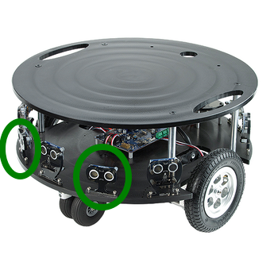

|  Introduction to Robotics |  Ferdowsi University of Mashhad |
|---|---|
|  Instructor: Arash Sal Moslehian |  Computer Engineering Dept. |

# Exercise 1

Proceed to the *eddiebot_description* package and go to the *urdf/sensors* directory.

Create a file called ultrasonic_sensor.urdf.xacro. This file will include the visual, collision, and sensor configuration of our ultrasonic sensor. Currently gazebo does not have a dedicated Ultrasonic or IR sensor (see [#19](https://github.com/gazebosim/gz-sensors/issues/19)). However, the behavior of Ultrasonic and IR sensors can be estimated using LIDAR sensors.

Eddie has an array of Ultrasonic and IR sensors on the front of its chassis. In this Lab you are asked to create two Ultrasonic sensors and have them placed like the circled sensors in the figure below:



You will be given the physical robot in the class to accurately measure the position of each sensor. The visual and collision of each sensor is a simple cuboid that roughly represents the shape of the sensor in real world. Use the following configuration for the ultrasonic sensors (some names may need to be changed):

```xml
<sensor name='ultrasonic_ping_1' type='gpu_lidar'>"
        <always_on>1</always_on>
        <update_rate>5</update_rate>
        <visualize>1</visualize>
        <topic>ultrasonic_1</topic>
        <ray>
            <scan>
                <horizontal>
                    <samples>1</samples>
                    <resolution>1</resolution>
                    <min_angle>0</min_angle>
                    <max_angle>0</max_angle>
                </horizontal>
            </scan>
            <range>
                <min>0.08</min>
                <max>4</max>
                <resolution>0.02</resolution>
            </range>
            <noise>
                <type>gaussian</type>
                <mean>0.1</mean>
                <stddev>0.005</stddev>
            </noise>
        </ray>
</sensor>
```

The sensors must be defined as a xacro macro with proper arguments. The topic name and sensor name must use xacro arguments. Create three instances of this macro with proper names in the *urdf/stacks/create_base.urdf.xacro* file. They must be placed in the correct position and orientation.

# Exercise 2

Commit the changes you made in exercise 1. The commit message must be descriptive.

Launch the robot using Gazebo the same way we did in the previous assignments. From the top right menu, add five Visualize LIDAR GUI modules and click on the refresh button. Select one of the ultrasonic topics in each module.