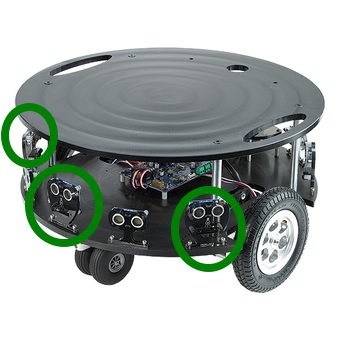

|  Introduction to Robotics |  Ferdowsi University of Mashhad |
|---|---|
|  Instructor: Arash Sal Moslehian |  Computer Engineering Dept. |


In this Lab we will add three IR sensors to our favorite robot Eddie and push the changes to an upstream repository

# Exercise 1

Commit the changes you made in the previous lab to the branch you created there. The commit message must be descriptive.

Go to the eddie's repository in your workspace and rename the branch that you created in the previous lab to :

```bash
$ git branch -m yourname_add_ultrasonic_ir_sensors
```

Proceed to the *eddiebot_description* package and go to the *urdf/sensors* directory.

Create a file called ir*\_sensor.urdf.xacro* . This file will include the visual, collision, and sensor configuration of our ir sensor. Currently gazebo does not have a dedicated Ultrasonic or IR sensor (see [#19](https://github.com/gazebosim/gz-sensors/issues/19)). However, the behavior of Ultrasonic and IR sensors can be estimated using LIDAR sensors.

Eddie has an array of Ultrasonic and IR sensors on the front of its chassis. In this Lab you are asked to create three IR sensors alongside the ultrasonic sensors that were added previously and have them placed like the circled sensors in the figure below:



You will be given the physical robot in the class to accurately measure the position of each sensor. The visual and collision of each sensor is a simple cuboid that roughly represents the shape of the sensor in real world. Use the following configuration for the IR sensors (some names may need to be changed):

```xml
<sensor name='ir_sensor_1' type='gpu_lidar'>"
        <always_on>1</always_on>
        <update_rate>5</update_rate>
        <visualize>1</visualize>
        <topic>ir_sensor_1</topic>
        <ray>
            <scan>
                <horizontal>
                    <samples>1</samples>
                    <resolution>1</resolution>
                    <min_angle>0</min_angle>
                    <max_angle>0</max_angle>
                </horizontal>
            </scan>
            <range>
                <min>0.1</min>
                <max>0.8</max>
                <resolution>0.02</resolution>
            </range>
            <noise>
                <type>gaussian</type>
                <mean>0.1</mean>
                <stddev>0.005</stddev>
            </noise>
        </ray>
</sensor>
```

The sensors must be defined as a xacro macro with proper arguments. The topic name and sensor name must use xacro arguments. Create three instances of this macro with proper names in the *urdf/stacks/create_base.urdf.xacro* file. They must be placed in the correct position and orientation.

# Exercise 2

Commit the changes you made in exercise 1. The commit message must be descriptive.

Launch the robot using Gazebo the same way we did in the previous assignments. From the top right menu, add five *Visualize LIDAR *GUI modules and click on the refresh button. Select one of the ultrasonic and ir topics in each module.

# Exercise 3

Create a pull request on GitHub for the [arashsm79/eddiebot-ros](https://github.com/arashsm79/eddiebot-ros) repository with the changes you made in the branch you created. Take your time to write a pull request message that is as descriptive as possible.

The PR of the person who has the best:

-   PR message
-   Commit organization and message
-   Code readability

will be accepted and merged into the repository.

You may need to learn how to create a pull request using an existing clone of a repository. Make sure you follow the correct instructions; most tutorials will teach you how to create a PR by creating a fork and cloning the fork and making the changes in that fork first, which is not what we want here. You need to fork the repo on GitHub, then add your forked repo as a remote to your local cloned copy.