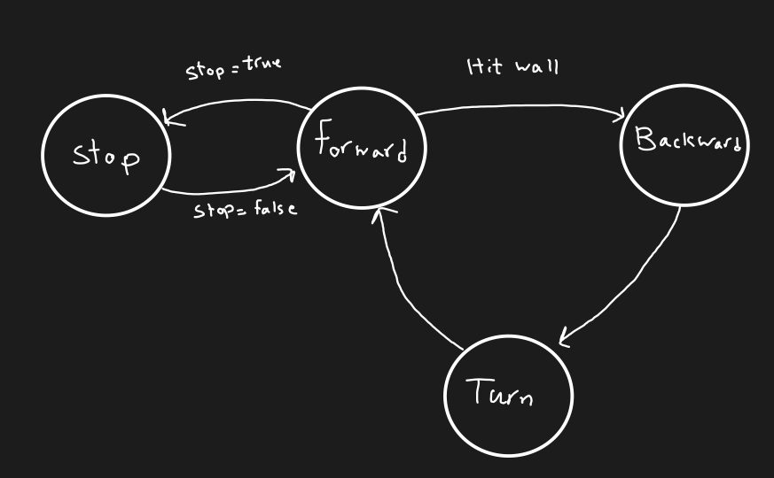
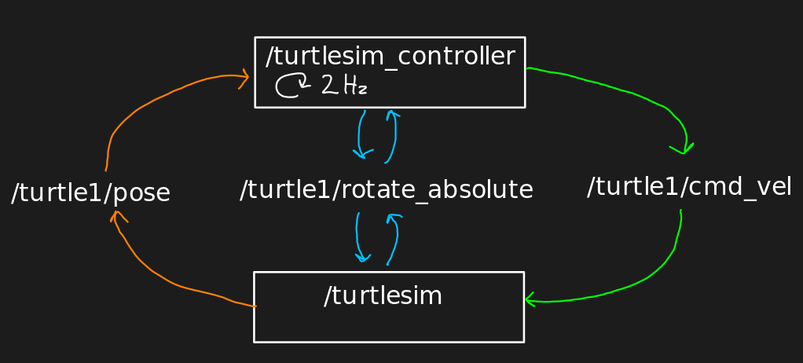

|  Introduction to Robotics |  Ferdowsi University of Mashhad |
|---|---|
|  Instructor: Arash Sal Moslehian |  Computer Engineering Dept. |

# Intelligent behavior with finite state machines

In this experiment, we are going to simulate the simplest type of intelligent robot using finite state machines or FSM. FSM is a mathematical computational model that consists of states and transitions, and we can use it to define the behavior of a simple robot.

A robot continues to process and produce output as long as it is in a state, and when the condition of a transition is met, it goes to the target state of this transition. Applying FSM can significantly reduce the complexity of solving a problem when we implement simple behaviors.

Design a ROS package with the name `turtlesim_controller` and a node with the same name that determines the behavior of a turtle in turtlesim according to the following FSM.

This node sends its control commands to the `/turtlesim` node with a frequency of 2 Hz. It has a parameter called stop, which is false by default, and if its value is changed to true, the controller must change its state to Stop and keep the state machine in that state, and the turtle will stop. If the turtle hits the wall, the control will go to Backward state and move backwards for about 2 seconds. The node should then use the `/turtle1/rotate_absolute/` action to randomly rotate the turtle in a direction and print the corresponding feedback. It should then return to the Forward state. The connections of the nodes are shown in the following figure:

During execution, if the stop parameter is changed, the robot should go to the appropriate state and perform the correct behavior. Said states must exist in the code with appropriate names and transitions from one state to the next must be clear.

You can checkout the code related to [turtlesim_teleop_key](https://github.com/ros/ros_tutorials/blob/db6328879831b4abadac939bd69b43133414c0db/turtlesim/tutorials/teleop_turtle_key.cpp) and [turtlesim](https://github.com/ros/ros_tutorials/tree/humble/turtlesim)  to get help.
