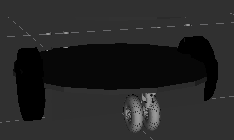

|  Introduction to Robotics |  Ferdowsi University of Mashhad |
|---|---|
|  Instructor: Arash Sal Moslehian |  Computer Engineering Dept. |

In this experiment, we are going to design a simple mobile robot and simulate it in Gazebo and then shake it using ROS2.

# Exercise 1

Using [this tutorial](https://gazebosim.org/docs/garden/building_robot) (and  [URDF](https://docs.ros.org/en/foxy/Tutorials/Intermediate/URDF/URDF-Main.html) in ROS2 which we have read before) design a mobile robot as shown below. The body of the robot is a short cylinder that is attached to both sides of the wheel and there is a caster wheel in front of it.

# Exercise 2

Using this [Tutorial](https://gazebosim.org/docs/garden/moving_robot) Add the diff_drive plugin and make the robot ready to move. Then send a message in the relevant topic for the bot to move forward.

# Exercise 3

Write a ROS2 package that uses [ros_gz_bridge](https://github.com/gazebosim/ros_gz/tree/ros2/ros_gz_bridge) to communicate Twist messages from ROS2 to gazebo and send the robot back and forth at 2 second intervals.  Use a launch file to run your bridge and node. (In the previous lab, you compiled the ros_gz package)
