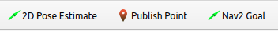

|  Introduction to Robotics |  Ferdowsi University of Mashhad |
|---|---|
|  Instructor: Arash Sal Moslehian |  Computer Engineering Dept. |

Autonomous navigation is a field of research that has seen significant progress in the past few years. An example of its application is in industry and factories, where a significant part of the costs is related to the movement of objects by human labor. The cost of handling factory materials can be reduced by using autonomous robotic vehicles. These autonomous robots can also navigate, with minimal human intervention, places that are dangerous for workers. There are various problems in autonomous navigation such as mapping, localization and planning. The purpose of this project is to discuss and demonstrate the concept of designing and simulating a mobile robot that is able to reach the desired destination independently by avoiding obstacles using SLAM.

The research field of Simultaneous Localization and Mapping (SLAM) tries to solve these problems by using a variety of sensors including: laser scanners, radars, cameras, encoders, GPS and IMUs. The most common sensor used for localization and mapping in industrial environments is a laser scanner. SLAM methods using laser scanners are generally considered the most robust methods in the field of SLAM and can provide accurate localization in the presence of dynamic obstacles and changing environments.

The robot navigation problem can be divided into 3 different subtasks or phases:

- Mapping
- Localization
- Planning

Mapping and localization are the main tasks of SLAM. Although autonomous exploration of the environment by a robot is one of the ambitious goals of this field, SLAM omits the complexity of planning during map construction and assumes that the robot is controlled by teleoperation or some other method.

# Mapping:
Map generation is a very important process in robot navigation, as it is usually used in the localization step as well. The map is a spatial reconstruction of the robot's surroundings. This reconstruction, also called a model, is created using the robot's sensors and cameras along with its odometry. These sensors play an important role in obtaining more accurate environmental information for processing and mapping. A variety of sensors such as sonar, infrared (IR), laser scanners, and LIDAR can be used to map the environment.


Since we only have a RGBD sensor in this course, we will also use the Visual SLAM method.

The created maps have different types, including:
- Occupancy Grid Maps
- Feature-Based
- Maps and Topological maps
Each of which has its uses depending on the type of sensor and the environment that is to be mapped.

# Localization:

Robot localization is the process of determining the location of a moving robot according to its environment, localization answers the question "where is the robot now?". If we have a mathematical model of motion, a mobile robot equipped with sensors to monitor its motion (such as wheel encoders and inertial sensors) can calculate an estimate of its location relative to where it started. This is the same odometry that we learned about in the exercises, and in a mobile robot, it can be called as an estimate of the robot's position relative to the world coordinate system. The robot can be calibrated to reduce the systematic error caused by incorrect parameter values, but unsystematic errors caused by environmental factors such as slippery floors and excessive accelerations cannot be avoided. In SLAM, the loop closure method is used to correct the odometry error. The closed-loop approach tries to find out if the robot has already seen the region it is in. This method is also done to avoid adding additional information (information of an already seen area) and thus avoiding unnecessary computational cost.

# Planning:
The planning phase consists of finding the optimal path between the current position and the target position while avoiding any obstacles. Planning can be divided into two categories:

- Off-line path-planning (Global planning): In off-line planning, before planning, the robot must know the environment and have a map of the environment. Some of these types of algorithms are: Dijkstra's algorithm and A\* algorithm. In online programming, the robot must locate itself continuously. LIDAR technology is usually used to do this.
- On-line path-planning (Local planning):
     In this method, the robot does not have a map of the environment in advance and must create it during planning. This method is used for variable and dynamic environments. Vector Field Histogram and Dynamic Window Approach are its types.

So SLAM is about trying to localize during mapping.

# vSLAM

As the name suggests, Visual SLAM (or vSLAM) uses images obtained from cameras and other image sensors such as monocular cameras, stereo vision, omnidirectional or RGB-D cameras to localize and map the environment.  It is easy to understand how vSLAM works. The goal of such a system is to estimate the movement of the camera according to the displacement of pixels in successive images.

This method can be implemented at low cost with relatively cheap cameras. In addition, since cameras provide a large amount of information, they can be used to detect landmarks (previously measured positions). Milestone detection can also be done by optimization based on combine the graph and achieve flexibility in SLAM implementation.

Early vSLAM techniques were performed with monocular cameras and used feature points
to identify the image. These techniques were called "feature-based" approaches.


Over time, vSLAM has moved towards using "direct approaches", that is, algorithms that They can use the whole image to track the robot. The feature recognition method is shown in the upper part and the direct method in the lower part of the figure above. vSLAM is still an emerging technology; Deep learning, multimodal, reinforcement, etc. methods are continuously used to solve SLAM problems in modern researches.

In this phase, we intend to have a very simple introduction to the SLAM process. A large part of the SLAM methods that are used today are based on laser scanning, but since we do not have access to these sensors, we can convert the depth image to laser scanning (this has been done in the previous exercises).

This method does not have the power and quality of real laser scanning and cannot give us the great results. However, before going to visual SLAM in the next phase, we will try to move Eddie in a new environment using gazebo and make a map of its surrounding environment.

# Exercise 1

Pull the latest changes from the [arashsm79/eddiebot-ros](https://github.com/arashsm79/eddiebot-ros) repository into your ws and install the dependencies with rosdep.

Using the command:
```bash
ros2 launch eddiebot_gazebo eddiebot_gz_sim.launch.py world:='maze_tight' use_sim_time:='true'
```
Run Gazebo and start the simulation.


Run rviz using: 
```bash
ros2 launch eddiebot_rviz view_robot.launch.py use_sim_time:=true
```


Then go to the eddiebot_nav/maps folder and run the following command:
```bash
ros2 launch eddiebot_nav slam.launch.py sync:=false use_sim_time:=true*
```

Using Teleop in Gazebo, move the robot slowly and try to map the environment in rviz. (Note that the created map is not perfect and will contain many inconsistencies because slam_toolbox is designed for real laser scanners with a wide range and viewing angle and our wheel encoders are insufficient for accurate odometry)


Finally with the command:

```bash
ros2 service call /slam_toolbox/save_map slam_toolbox/srv/SaveMap
"name:
data: 'maze_tight'"
```

You can save the generated map. (It will be saved in the location where you executed the slam.)

# Exercise 2

Close all programs. Run Gazebo and rviz again with the previous commands.
Run the following two commands to start AMCL localization and bringup [navigation2](https://navigation.ros.org/). nodes.

```bash
$ ros2 launch eddiebot_nav localization.launch.py use_sim_time:=true
world:="maze_tight.yaml"

$ ros2 launch eddiebot_nav nav2.launch.py use_sim_time:=true
```


In rviz, first specify the location and direction of the robot (by holding the click) using 2D pose estimate, and then select a location on the map with Nav2 Goal so that planning can be done for it and the robot can move.



Watch the bot move in Gazebo and rviz. 

# Exercise 3

Get to know the contents of launch files and used packages. To improve routing and mapping, you can read and change the relevant configuration files. Write the reason for your changes and explain the reason for the improvement.